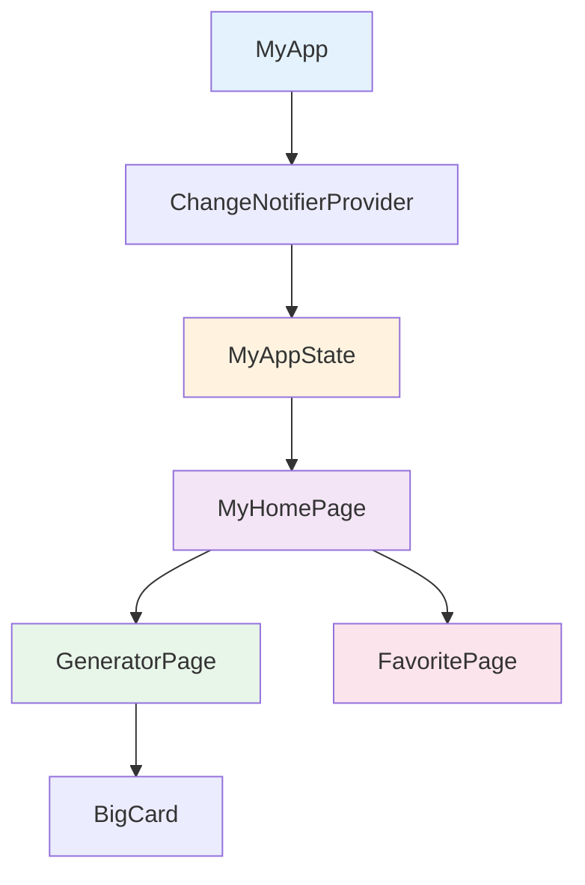
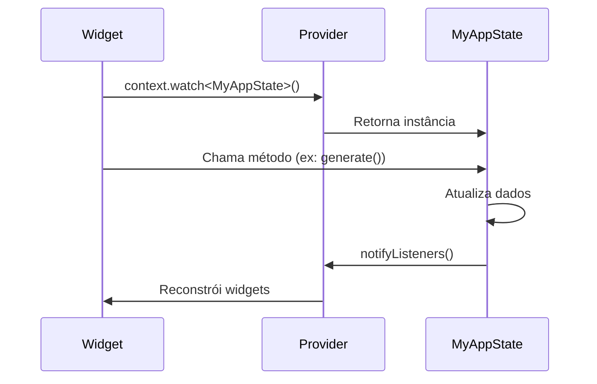

# My Awesome Namer - Documentação do Projeto

## 📋 Índice

- [Visão Geral](#visão-geral)
- [Tecnologias Utilizadas](#tecnologias-utilizadas)
- [Arquitetura do Projeto](#arquitetura-do-projeto)
- [Estrutura de Diretórios](#estrutura-de-diretórios)
- [Componentes Principais](#componentes-principais)
- [Gerenciamento de Estado](#gerenciamento-de-estado)
- [Funcionalidades](#funcionalidades)
- [Como Executar](#como-executar)
- [Plataformas Suportadas](#plataformas-suportadas)

---

## 🎯 Visão Geral

**My Awesome Namer** é uma aplicação Flutter que gera nomes aleatórios compostos (word pairs) em inglês. O usuário pode gerar novos nomes, marcar seus favoritos e gerenciar uma lista de nomes salvos.

### Objetivo

Demonstrar conceitos fundamentais do Flutter, incluindo:
- Gerenciamento de estado com Provider
- Navegação entre páginas
- Layouts responsivos
- Material Design 3
- Componentização

---

## 🛠️ Tecnologias Utilizadas

| Tecnologia | Versão | Descrição |
|------------|--------|-----------|
| **Flutter** | SDK 3.10.4+ | Framework de desenvolvimento multiplataforma |
| **Dart** | 3.10.4+ | Linguagem de programação |
| **Provider** | 6.0.0 | Gerenciamento de estado |
| **English Words** | 4.0.0 | Geração de palavras aleatórias em inglês |
| **Material Design 3** | - | Sistema de design da interface |

### Dependências

```yaml
dependencies:
  flutter:
    sdk: flutter
  english_words: ^4.0.0
  provider: ^6.0.0

dev_dependencies:
  flutter_test:
    sdk: flutter
  flutter_lints: ^2.0.0
```

---

## 🏗️ Arquitetura do Projeto

O projeto segue uma arquitetura simples baseada em **Provider** para gerenciamento de estado:



### Camadas da Aplicação

1. **Camada de Apresentação**: Widgets visuais (Pages e Components)
2. **Camada de Estado**: `MyAppState` (ChangeNotifier)
3. **Camada de Dados**: Gerenciamento de favoritos e palavra atual

---

## 📁 Estrutura de Diretórios

```
my_awesome_namer/
├── android/              # Configurações Android
├── ios/                  # Configurações iOS
├── linux/                # Configurações Linux
├── macos/                # Configurações macOS
├── web/                  # Configurações Web
├── windows/              # Configurações Windows
├── lib/
│   └── main.dart        # Arquivo principal da aplicação
├── test/
│   └── widget_test.dart # Testes de widgets
├── pubspec.yaml         # Dependências do projeto
├── README.md            # Documentação básica
└── DOCUMENTATION.md     # Esta documentação
```

---

## 🧩 Componentes Principais

### 1. MyApp

**Arquivo**: [`lib/main.dart`](file:///Users/richard/my_awesome_namer/lib/main.dart#L9-L26)

Widget raiz da aplicação que configura:
- Provider para gerenciamento de estado
- Tema Material Design 3
- Esquema de cores baseado em `Colors.blueAccent`

```dart
class MyApp extends StatelessWidget {
  const MyApp({super.key});

  @override
  Widget build(BuildContext context) {
    return ChangeNotifierProvider(
      create: (context) => MyAppState(),
      child: MaterialApp(
        title: 'Namer App',
        theme: ThemeData(
          useMaterial3: true,
          colorScheme: ColorScheme.fromSeed(seedColor: Colors.blueAccent),
        ),
        home: MyHomePage(),
      ),
    );
  }
}
```

---

### 2. MyAppState

**Arquivo**: [`lib/main.dart`](file:///Users/richard/my_awesome_namer/lib/main.dart#L28-L51)

Classe de gerenciamento de estado que estende `ChangeNotifier`.

#### Propriedades

| Propriedade | Tipo | Descrição |
|-------------|------|-----------|
| `current` | `WordPair` | Palavra atual gerada |
| `favorites` | `List<WordPair>` | Lista de palavras favoritas |

#### Métodos

| Método | Descrição |
|--------|-----------|
| `toggleFavorite()` | Adiciona ou remove a palavra atual dos favoritos |
| `removeFavorite(WordPair pair)` | Remove uma palavra específica dos favoritos |
| `generate()` | Gera uma nova palavra aleatória |

```dart
class MyAppState extends ChangeNotifier {
  var current = WordPair.random();
  var favorites = <WordPair>[];

  void toggleFavorite() {
    if (favorites.contains(current)) {
      favorites.remove(current);
    } else {
      favorites.add(current);
    }
    notifyListeners();
  }

  void removeFavorite(WordPair pair) {
    favorites.remove(pair);
    notifyListeners();
  }

  void generate() {
    current = WordPair.random();
    notifyListeners();
  }
}
```

---

### 3. MyHomePage

**Arquivo**: [`lib/main.dart`](file:///Users/richard/my_awesome_namer/lib/main.dart#L53-L113)

Página principal com navegação lateral usando `NavigationRail`.

#### Características

- **Layout Responsivo**: `NavigationRail` se expande em telas maiores (≥600px)
- **Navegação**: Alterna entre `GeneratorPage` e `FavoritePage`
- **Design Adaptativo**: Usa `LayoutBuilder` para responsividade

#### Destinos de Navegação

| Índice | Ícone | Label | Página |
|--------|-------|-------|--------|
| 0 | `Icons.home` | Home | `GeneratorPage` |
| 1 | `Icons.favorite` | Favorites | `FavoritePage` |

---

### 4. GeneratorPage

**Arquivo**: [`lib/main.dart`](file:///Users/richard/my_awesome_namer/lib/main.dart#L184-L228)

Página principal que exibe a palavra atual e permite gerar novas palavras ou adicionar aos favoritos.

#### Elementos da Interface

1. **BigCard**: Exibe a palavra atual
2. **Botão Favorito**: Adiciona/remove dos favoritos (ícone dinâmico)
3. **Botão Generate**: Gera nova palavra aleatória

```dart
Row(
  mainAxisSize: MainAxisSize.min,
  children: [
    ElevatedButton.icon(
      onPressed: () => appState.toggleFavorite(),
      icon: Icon(isFavorite ? Icons.favorite : Icons.favorite_border),
      label: Text(isFavorite ? 'Remove' : 'Favorite'),
    ),
    SizedBox(width: 10),
    ElevatedButton(
      onPressed: () => appState.generate(),
      child: Text('Generate'),
    ),
  ],
)
```

---

### 5. FavoritePage

**Arquivo**: [`lib/main.dart`](file:///Users/richard/my_awesome_namer/lib/main.dart#L115-L182)

Página que exibe a lista de palavras favoritas.

#### Características

- **Estado Vazio**: Exibe ícone e mensagem quando não há favoritos
- **Lista Dinâmica**: Usa `ListView.builder` para renderização eficiente
- **Cards Estilizados**: Cada favorito é exibido em um `Card` com bordas arredondadas
- **Ação de Remoção**: Botão de deletar em cada item

#### Estrutura do Card

```dart
Card(
  elevation: 1,
  shape: RoundedRectangleBorder(
    borderRadius: BorderRadius.circular(12),
    side: BorderSide(
      color: theme.colorScheme.outline.withValues(alpha: 0.2),
    ),
  ),
  child: ListTile(
    leading: Icon(Icons.favorite, color: theme.colorScheme.primary),
    subtitle: Text('${pair.first}${pair.second}'),
    title: Text("#${favorites.indexOf(pair) + 1}"),
    trailing: IconButton(
      onPressed: () => appState.removeFavorite(pair),
      icon: Icon(Icons.delete_outline),
      color: theme.colorScheme.error,
    ),
  ),
)
```

#### Estado Vazio

Quando não há favoritos, exibe:
- Ícone de coração vazio (64px)
- Mensagem "No favorites yet"
- Cores com opacidade reduzida para indicar estado inativo

---

### 6. BigCard

**Arquivo**: [`lib/main.dart`](file:///Users/richard/my_awesome_namer/lib/main.dart#L230-L250)

Componente que exibe a palavra atual em destaque.

#### Características

- **Estilo Tipográfico**: Usa `displayMedium` do tema
- **Cores Temáticas**: Fundo com cor primária, texto com cor `onPrimary`
- **Formato**: Exibe as palavras separadas por hífen (ex: "random-word")

```dart
Card(
  color: theme.colorScheme.primary,
  child: Padding(
    padding: const EdgeInsets.all(8.0),
    child: Text(
      "${pair.first}-${pair.second}",
      style: theme.textTheme.displayMedium!.copyWith(
        color: theme.colorScheme.onPrimary,
      ),
    ),
  ),
)
```

---

## 🔄 Gerenciamento de Estado

O projeto utiliza o padrão **Provider** para gerenciamento de estado.

### Fluxo de Dados



### Padrão Observer

- **ChangeNotifier**: `MyAppState` notifica mudanças
- **Consumer**: Widgets observam mudanças via `context.watch<MyAppState>()`
- **Reatividade**: UI atualiza automaticamente quando estado muda

---

## ✨ Funcionalidades

### 1. Geração de Palavras

- Gera pares de palavras aleatórias em inglês
- Usa a biblioteca `english_words`
- Atualiza instantaneamente a interface

### 2. Gerenciamento de Favoritos

| Ação | Descrição |
|------|-----------|
| **Adicionar** | Toca no botão "Favorite" na página inicial |
| **Remover** | Toca no botão "Remove" ou no ícone de lixeira na lista |
| **Visualizar** | Navega para a aba "Favorites" |

### 3. Navegação

- **NavigationRail**: Barra lateral de navegação
- **Responsivo**: Expande em telas maiores
- **Duas páginas**: Home (Generator) e Favorites

### 4. Interface Responsiva

- **Breakpoint**: 600px de largura
- **Mobile**: NavigationRail compacto (apenas ícones)
- **Desktop**: NavigationRail expandido (ícones + labels)

---

## 🚀 Como Executar

### Pré-requisitos

- Flutter SDK 3.10.4 ou superior
- Dart 3.10.4 ou superior
- Editor de código (VS Code, Android Studio, etc.)

### Instalação

1. **Clone o repositório** (se aplicável):
   ```bash
   git clone <repository-url>
   cd my_awesome_namer
   ```

2. **Instale as dependências**:
   ```bash
   flutter pub get
   ```

3. **Execute a aplicação**:
   ```bash
   flutter run
   ```

### Comandos Úteis

| Comando | Descrição |
|---------|-----------|
| `flutter run` | Executa a aplicação |
| `flutter test` | Executa os testes |
| `flutter build <platform>` | Compila para produção |
| `flutter clean` | Limpa arquivos de build |
| `flutter doctor` | Verifica configuração do ambiente |

---

## 📱 Plataformas Suportadas

O projeto está configurado para as seguintes plataformas:

| Plataforma | Status | Diretório |
|------------|--------|-----------|
| **Android** | ✅ Configurado | `/android` |
| **iOS** | ✅ Configurado | `/ios` |
| **Web** | ✅ Configurado | `/web` |
| **Windows** | ✅ Configurado | `/windows` |
| **macOS** | ✅ Configurado | `/macos` |
| **Linux** | ✅ Configurado | `/linux` |

### Requisitos por Plataforma

#### Android
- Android SDK
- Gradle

#### iOS / macOS
- Xcode
- CocoaPods

#### Web
- Navegador moderno (Chrome, Firefox, Safari, Edge)

#### Windows
- Visual Studio 2019 ou superior

#### Linux
- Bibliotecas GTK

---

## 🎨 Design System

### Esquema de Cores

O aplicativo usa **Material Design 3** com esquema de cores gerado a partir de `Colors.blueAccent`.

#### Cores Principais

- **Primary**: Azul (derivado de `blueAccent`)
- **OnPrimary**: Branco (texto sobre cor primária)
- **PrimaryContainer**: Azul claro (fundo de containers)
- **Error**: Vermelho (ações destrutivas)

### Tipografia

Usa a tipografia padrão do Material Design 3:

- **displayMedium**: Palavra principal no BigCard
- **titleMedium**: Palavras na lista de favoritos
- **bodyLarge**: Mensagens de estado vazio

### Componentes

- **Card**: Bordas arredondadas (12px), elevação sutil
- **ElevatedButton**: Botões com elevação
- **IconButton**: Botões de ação (favoritar, deletar)
- **NavigationRail**: Navegação lateral

---

## 🧪 Testes

O projeto inclui testes básicos de widgets em [`test/widget_test.dart`](file:///Users/richard/my_awesome_namer/test/widget_test.dart).

### Executar Testes

```bash
flutter test
```

---

## 📝 Notas de Desenvolvimento

### Boas Práticas Implementadas

1. **Componentização**: Widgets reutilizáveis e focados
2. **Separação de Responsabilidades**: Estado separado da UI
3. **Responsividade**: Layout adaptativo
4. **Acessibilidade**: Uso de labels semânticos
5. **Material Design 3**: Design moderno e consistente

### Possíveis Melhorias Futuras

- [ ] Persistência de dados (SharedPreferences ou SQLite)
- [ ] Animações de transição
- [ ] Temas claro/escuro
- [ ] Busca e filtros na lista de favoritos
- [ ] Compartilhamento de palavras
- [ ] Internacionalização (i18n)
- [ ] Testes de integração

---

## 📄 Licença

Este é um projeto de demonstração Flutter.

---

## 👤 Autor

Desenvolvido como projeto de aprendizado Flutter.

---

## 📚 Recursos Adicionais

- [Documentação Flutter](https://docs.flutter.dev/)
- [Provider Package](https://pub.dev/packages/provider)
- [English Words Package](https://pub.dev/packages/english_words)
- [Material Design 3](https://m3.material.io/)

---

**Última atualização**: 2026-01-09
